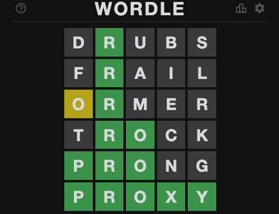

# Automated AI for wordle game

Wordle is a small daily game that asks you to find a secret five letters word in six or less guesses.

This repository allows you to easily create your own artificial intelligence and to watch it play Wordle online.

---  

*Example of a wordle example grid*  

After each guess the game let you know if a given exists inside the secret word and if its position is correct.

**Legend:**
* Green tile: The letter exist and is at the correct spot
* Yellow tile: The letter is present inside the secret word but at a different position
* Black tile: Letter does not exist inside the secret word

---  

## Setup

To work run this repository, you need to have python 3.6 or higher installed on your machine. You can quickly install all the required library by running the following command:

`pip install -r requirement.txt`

You also need to download a version of [chromedriver](https://chromedriver.chromium.org/downloads), add it to your $PATH and copy its path inside the config.ini file. 
You can use [config.example.ini](./config.example.ini) as a template.

## Running the AI

`cd src`  
`python3 wordle_web.py`

> **Warning**: You're keyboard layout must be in qwerty.

## Add a new player 

Your player should extend the Player class located [here](src/wordle_player.py).
A Player as at least two methods:
    -> guess() that predict a word
    -> analyse_hints(guess, hints) that gets hints regarding to your last guess

**Guessing:**

You can only guess word that exist in the game dictionnary

**Analyzing hints:**

Hints are an array filled with the following values: 
* "correct" -> letter at the given position was correct
* "present" -> letter at the given position exist inside the secret word but not at this position
* "absent" -> letter does not exist inside the secret word

**Example:**

secret_word = "plane"
guess = "large"
hints = ["correct", "present", "absent", "absent", "correct"]

## Becnhmark scores
To test your AI performances, you can use the benchmark [file](./src/benchmark.py). This will let you simulate 
a huge number of games and returns the average number of guesses required by your Player instance.